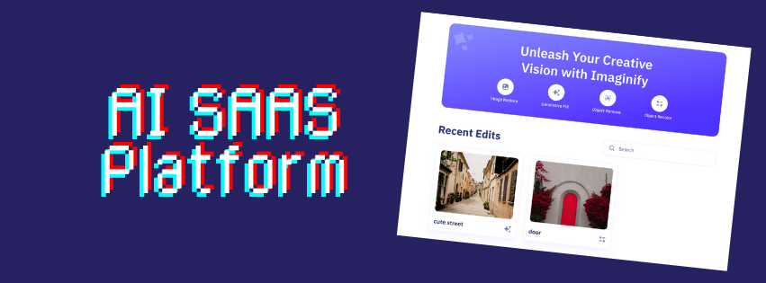

# AI Image Tools Platform


**Imaginify** is a cloud-based SaaS solution offering a robust set of AI-driven image enhancement services. From secure payment handling to intelligent image searching, the platform empowers users with next-gen features like image restoration, color adjustment, content-aware fill, object deletion, and background extraction.

---

## Tech Stack

- **Next.js** – React framework tailored for scalable web applications  
- **TypeScript** – Type-safe JavaScript for enhanced development experience  
- **MongoDB** – Flexible NoSQL database solution  
- **Clerk** – Seamless authentication and user access control  
- **Cloudinary** – Media storage and transformation in the cloud  
- **Stripe** – Trusted online payment infrastructure  
- **Shadcn** – Collection of pre-built, customizable UI components  
- **TailwindCSS** – Utility-first CSS framework for responsive design  

---

## Key Features

- **User Authentication & Access Control** – Register, sign in, and navigate securely across protected routes  
- **Image Gallery & Community Showcase** – Discover user-submitted creations with effortless pagination  
- **Intelligent Image Lookup** – Search visuals based on content or detected objects  
- **Photo Repair** – Bring life back to aged or damaged pictures  
- **Dynamic Recoloring** – Modify object colors to personalize your images  
- **AI-Powered Fill** – Automatically generate content in missing image regions  
- **Item Removal** – Remove unwanted items from photos with high accuracy  
- **Background Isolation** – Easily separate subjects from their backgrounds  
- **Download Options** – Save and share your enhanced visuals  
- **Detailed Transformation Logs** – Inspect AI processing details per image  
- **Edit & Manage Outputs** – Delete or update previously generated results  
- **Credit-Based System** – Earn or purchase credits to access premium features  
- **Personal Dashboard** – Track your usage history and remaining credits  
- **Stripe Integration for Purchases** – Secure and smooth credit transactions  
- **Adaptive Design** – Enjoy a consistent experience across devices  

---

## Getting Started

Set up PixelMind locally by following the steps below.

### Prerequisites

Ensure you have the following tools installed:

- Git  
- Node.js  
- npm  

### Clone the Repository

```bash
git clone [git@github.com:yourusername/pixelmind-platform.git](https://github.com/EricFeng20001120/Imaginify.git)
cd imaginify
```

### Install Dependencies

```bash
npm install
```

### Configure Environment Variables

Create a file named `.env.local` in the root directory and add the following entries:

```
# NEXT
NEXT_PUBLIC_SERVER_URL=

# MONGODB
MONGODB_URL=

# CLERK
NEXT_PUBLIC_CLERK_PUBLISHABLE_KEY=
CLERK_SECRET_KEY=
WEBHOOK_SECRET=

NEXT_PUBLIC_CLERK_SIGN_IN_URL=/sign-in
NEXT_PUBLIC_CLERK_SIGN_UP_URL=/sign-up
NEXT_PUBLIC_CLERK_AFTER_SIGN_IN_URL=/
NEXT_PUBLIC_CLERK_AFTER_SIGN_UP_URL=/

# CLOUDINARY
NEXT_PUBLIC_CLOUDINARY_CLOUD_NAME=
CLOUDINARY_API_KEY=
CLOUDINARY_API_SECRET=

# STRIPE
STRIPE_SECRET_KEY=
STRIPE_WEBHOOK_SECRET=
NEXT_PUBLIC_STRIPE_PUBLISHABLE_KEY=
```

Update the placeholders with your actual keys, which can be found in your Clerk, MongoDB, Cloudinary, and Stripe dashboards.

---

### Launch the App

```bash
npm run dev
```

---

> Special thanks to JS Mastery for the foundational concepts and project guidance.
